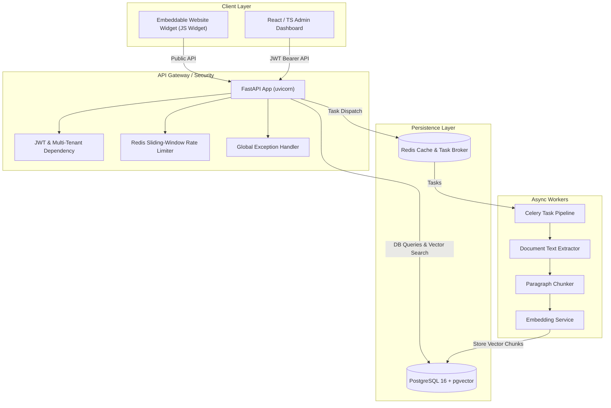

# 🤖 AI Customer Support SaaS Platform

An enterprise-grade, multi-tenant AI Customer Support platform built with **FastAPI**, **PostgreSQL (`pgvector`)**, **Redis**, **Celery**, and **React (TypeScript + Vite)**.

The platform enables organizations to train custom support AI models on their knowledge bases (PDF, DOCX, TXT, MD), embed floating chat widgets on their websites, ground AI answers with document citations, handle automatic or manual human agent escalations, and audit all platform actions.

---

## 📐 Architecture Overview



---

## ✨ Key Features

- **Logical Multi-Tenancy**: Strict tenant isolation on every single database query using `organization_id` filters and RBAC (`owner`, `admin`, `agent`).
- **Knowledge Base Pipeline**: Support for `.pdf`, `.docx`, `.txt`, and `.md` file ingestion. Asynchronous processing via Celery chunking text and generating 1536-dimensional embeddings.
- **RAG & Grounded Chat**: Cosine similarity vector search in `pgvector`. Grounded prompt engineering enforcing zero-hallucination guardrails and returning relevance-scored citations.
- **Human Escalation Queue**: Keyword-triggered or explicit customer escalation to human agent queue. Agents can self-assign, reply live, create internal notes, or request AI-suggested draft replies.
- **Embeddable Chat Widget**: Lightweight, responsive floating chat launcher with session persistence, typing indicator, document citation chips, and dark mode glassmorphism UI.
- **Rate Limiting**: Redis-backed sliding window rate limiter (`RateLimiter`) protecting auth (10 req/min), widget (30 req/min), and upload endpoints (5 req/min) with fail-open safety.
- **Audit Logging**: Comprehensive `audit_logs` tracking registration, logins, document uploads/deletions, member additions, configuration updates, and escalations with tenant isolation.
- **Structured Error Handling**: Custom `AppException` hierarchy delivering consistent JSON error responses (`error.code`, `error.message`, `error.details`) without leaking internal tracebacks.

---

## 🛠️ Technology Stack

| Component | Technology |
|---|---|
| **Backend Framework** | FastAPI (Python 3.12) |
| **Database** | PostgreSQL 16 with `pgvector` extension |
| **ORM & Migrations** | SQLAlchemy 2.0 (Async) + Alembic |
| **Task Queue & Cache** | Celery + Redis 7.2 |
| **AI Abstraction** | OpenAI GPT-4o-mini & Text-Embedding-3-Small (with Mock Fallbacks) |
| **Frontend Dashboard** | React 18, TypeScript, Vite, Vanilla CSS |
| **Iconography** | Lucide React |
| **Containerization** | Docker & Docker Compose |

---

## 🚀 Quickstart Guide

### Prerequisites
- [Docker](https://docs.docker.com/get-docker/) & [Docker Compose](https://docs.docker.com/compose/)

### 1. Launch Environment
```bash
docker compose up --build -d
```

### 2. Run Database Migrations
```bash
docker compose run --rm backend alembic upgrade head
```

### 3. Verify Health Check
- **API Health**: [http://localhost:8000/health](http://localhost:8000/health) -> `{"status":"healthy","database":"OK","redis":"OK"}`
- **Admin Dashboard**: [http://localhost:5173](http://localhost:5173)

---

## 🧪 Testing

The repository features comprehensive automated test suites using `pytest` and `pytest-asyncio`. When `LLM_API_KEY=mock-key`, all tests execute 100% offline using deterministic mock fallbacks.

Run the test suite inside the backend container:
```bash
docker compose exec backend pytest -v
```

### Test Coverage Areas
- `test_auth.py`: Registration, login, JWT validation, tenant isolation, RBAC
- `test_documents.py`: File upload, format validation, size checks, deletion, reprocess
- `test_rag.py`: RAG grounding, confidence thresholding, citations, keyword escalation
- `test_support.py`: Support queue, agent assignment, replies, notes, AI-suggested replies, resolve/reopen
- `test_widget_api.py`: Public branding config, session resume, widget messaging, explicit escalation
- `test_rate_limit.py`: Sliding-window limiting, 429 response formatting, fail-open behavior
- `test_audit_log.py`: Audit record creation, paginated listing, action filtering, tenant isolation
- `test_error_handling.py`: Structured JSON exception envelopes, 422 validation output

---

## ⚙️ Environment Variables

Configuration is loaded via Pydantic BaseSettings from `.env`:

| Variable | Default | Description |
|---|---|---|
| `DATABASE_URL` | `postgresql+asyncpg://...` | Async PostgreSQL connection string |
| `REDIS_URL` | `redis://redis:6379/0` | Redis connection URL for Celery and rate limiting |
| `JWT_SECRET` | `supersecret...` | Secret key for signing JWT tokens |
| `JWT_ACCESS_TOKEN_EXPIRE_MINUTES` | `60` | JWT token expiration time |
| `LLM_PROVIDER` | `openai` | AI LLM provider |
| `LLM_API_KEY` | `mock-key` | LLM API Key (use `mock-key` for offline test mode) |
| `LLM_MODEL` | `gpt-4o-mini` | LLM model identifier |
| `EMBEDDING_PROVIDER` | `openai` | Vector embedding provider |
| `EMBEDDING_API_KEY` | `mock-key` | Embedding API Key (use `mock-key` for offline test mode) |
| `EMBEDDING_MODEL` | `text-embedding-3-small` | Embedding model identifier |
| `CORS_ORIGINS` | `["http://localhost:5173"]` | Allowed CORS origins for frontend and widget |
| `MAX_UPLOAD_SIZE_MB` | `10` | Maximum document upload file size in MB |

---

## 📜 License

MIT License. Designed and built as a portfolio SaaS platform project.
